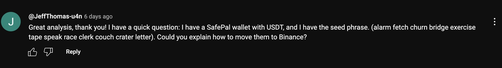

# no-u-honeypot

There's this interesting attack designed to target unsophisticated crypto users.

Basically, an attacker will masquerade like a victim that has straight up rocks for brains and shares their seed phrase on social media:

<p align="center">
  
</p>

> [**Origin Story**](https://github.com/cawfree/no-u-honeypot/blob/6f43208305bcef40e4404d739439cfc9d0b31f7c/__tests__/index.test.ts#L16) found on [**Double entry point issues**](https://www.youtube.com/watch?v=aq0n0T0wAeQ) by [**@holajotola**](https://x.com/holajotola).

Once the address is derived, consulting the block explorer will reveal an EOA that has some ERC-20 balance, but no underlying ether to cover the cost of taking the tokens out.

Would-be attakers, now incensed in by the promise of free tokens, will attempt to donate a little ether to cover the cost of exfiltrating the tokens via the public mempool.

However, **the attacker is smarter than they are**.

They're monitoring the mempool for pending donations and will immediately backrun the donation transaction with a transfer to their own address. This allows the attacker to make off with the donation and for the ERC-20s to remain inside the EOA to temp the next sucka.

## how to exploit the exploiters

This whole attack works because no-one is going to go to the effort of writing a Flashbots transaction bundle to atomically transfer the ether and withdraw the tokens... _right_?

Well, that's where [**no-u-honeypot**](https://github.com/cawfree/no-u-honeypot) comes in.

```shell
git clone git@github.com:cawfree/no-u-honeypot.git
cd no-u-honeypot
cp .env.example .env # add required variables
yarn
yarn eat "alarm fetch churn bridge exercise tape speak race clerk couch crater letter" # take the tokens
```

> btw you might also like [`piggyback`](https://github.com/cawfree/piggyback), a poison erc20 deployer

## license
[**CC0-1.0**](LICENSE)
